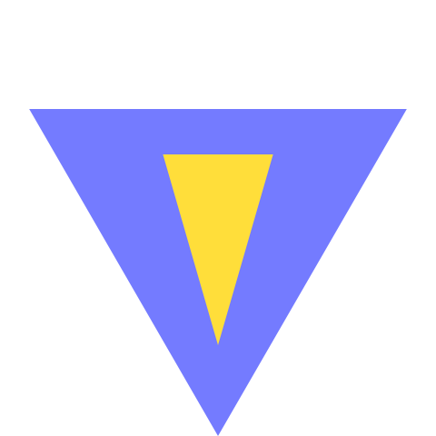

# Vlite



Lite demo server, inspired by Vite

## Features

- Zero-config
- ESM-friendly
- Straightforward compilations
- Support Vue, React, and Vanilla
- Support TypeScript, JSX, and TSX
- Support CSS Modules and Scoped CSS
- No node_modules installation required (package imports will be redirected to esm.sh)
- No HMR, no SSR, no plugins, no bundling, no production

## Installation

```bash
npm install -g @jinjiang/vlite
# or
yarn global add @jinjiang/vlite
# or
pnpm add -g @jinjiang/vlite
```

## Getting Started

A quick Vue demo

```bash
echo "<div id=\"app\"></div><script type=\"module\" src=\"./main.ts\"></script>" > index.html
echo "import { createApp } from 'vue'\nimport App from './App.vue'\ncreateApp(App).mount('#app')" > main.ts
echo "<template><h1>Hello, Vlite\!</h1></template>" > App.vue
vlite
```

A quick React demo

```bash
echo "<div id=\"app\"></div><script type=\"module\" src=\"./main.tsx\"></script>" > index.html
echo "import React from 'react'\nimport ReactDOM from 'react-dom'\nReactDOM.render(<h1>Hello, World\!</h1>, document.getElementById('app'))" > main.tsx
vlite
```

## Usage

```bash
vlite [<target-dir>] [--port <port>]
vlite --help
vlite --version
```

## Examples

See [React example](./examples/react/) and [Vue example](./examples/vue/).

## License

MIT
